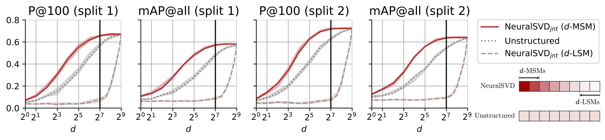

# Operator SVD via Nested Low-Rank Approximation

This repository contains the PyTorch implementation of `NeuralSVD` and the scripts to replicate the experiments 
in the paper "[**Operator SVD with Neural Networks via Nested Low-Rank Approximation**](https://openreview.net/forum?id=qESG5HaaoJ)" (ICML 2024).

**TL;DR**: The proposed `NeuralSVD` can learn the top-$`L`$ orthogonal singular functions of a given operator using neural networks. 

Conceptually, the optimization framework called "nested low-rank approximation" (thus abbreviated as `NestedLoRA`) is proposed,
and when neural networks are used to parameterize the singular- (or eigen-) functions, we call the overall method `NeuralSVD`. 


For a fair comparison, we also provide our PyTorch implementation of the most relevant works 
[`SpIN`](https://arxiv.org/abs/1806.02215) [(official Tensorflow implementation)](https://github.com/google-deepmind/spectral_inference_networks) and 
[`NeuralEF`](https://arxiv.org/pdf/2205.00165.pdf) ([official PyTorch implementation](https://github.com/thudzj/NeuralEigenFunction)) with a consistent I/O interface, 
which can be found under `methods/`.

[//]: # (Please install tensorflow following the [official instruction]&#40;https://www.tensorflow.org/install/pip&#41; to run SpIN over GPU.)

---
## Experiment 1. Solving Time-Independent Schrödinger Equations
Install the required dependency by running
```bash
. scripts/install/pde.sh
```

For the 2D hydrogen experiment, run 
```bash
. scripts/hydrogen.sh $loss_name $batch_size $seq
```
Here, the last flag `seq` indicates the version of nesting for `NestedLoRA`.

For example, to replicate the set of experiments, one can run 
```bash
conda activate pde
. scripts/exps/pde/hydrogen.sh neuralsvd 128 1  # sequential nesting
. scripts/exps/pde/hydrogen.sh neuralsvd 512 1  # sequential nesting
. scripts/exps/pde/hydrogen.sh neuralsvd 128 0  # joint nesting
. scripts/exps/pde/hydrogen.sh neuralsvd 512 0  # joint nesting
. scripts/exps/pde/hydrogen.sh neuralef 128 0  # last flag doesn't matter
. scripts/exps/pde/hydrogen.sh neuralef 512 0  # last flag doesn't matter
. scripts/exps/pde/hydrogen.sh spin 128 0  # last flag doesn't matter
```


For the 2D harmonic oscillator experiment, similarly run
```bash
conda activate pde
. scripts/exps/pde/oscillator.sh $loss_name $batch_size $seq
```


---
## Experiment 2. Cross-Domain Retrieval with Canonical Dependence Kernel
First, install the required dependency by running
```bash
. scripts/install/sketchy.sh
```

Then, follow the instruction of https://github.com/AnjanDutta/sem-pcyc to download the `Sketchy Extended` dataset.

To replicate the reported result, one can run
```bash
conda activate sketchy
. scripts/exps/sketchy.sh 1  # for split 1
. scripts/exps/sketchy.sh 2  # for split 2
```



---
## Citation
If you use `NeuralSVD` in your work, please cite the original paper as:
```bibtex
@inproceedings{Ryu--Xu--Erol--Bu--Zheng--Wornell2024,
    title={Operator {SVD} with Neural Networks via Nested Low-Rank Approximation},
    author={Ryu, J. Jon and Xu, Xiangxiang and Erol, H. S. Melihcan and Bu, Yuheng and Zheng, Lizhong and Wornell, Gregory W.},
    booktitle={Forty-first International Conference on Machine Learning},
    year={2024},
    url={https://openreview.net/forum?id=qESG5HaaoJ}
}
```
